# CriGent

**A local AI agent for Windows.** Chat with models that run entirely on your own
machine, let the agent run commands and search the web with your approval, save
reusable skills, watch your GPU and memory live, track what you have used, and
import new models from a `.gguf` file without touching a terminal.

No account, no API key, no telemetry. Nothing leaves the machine unless you
switch web search on.

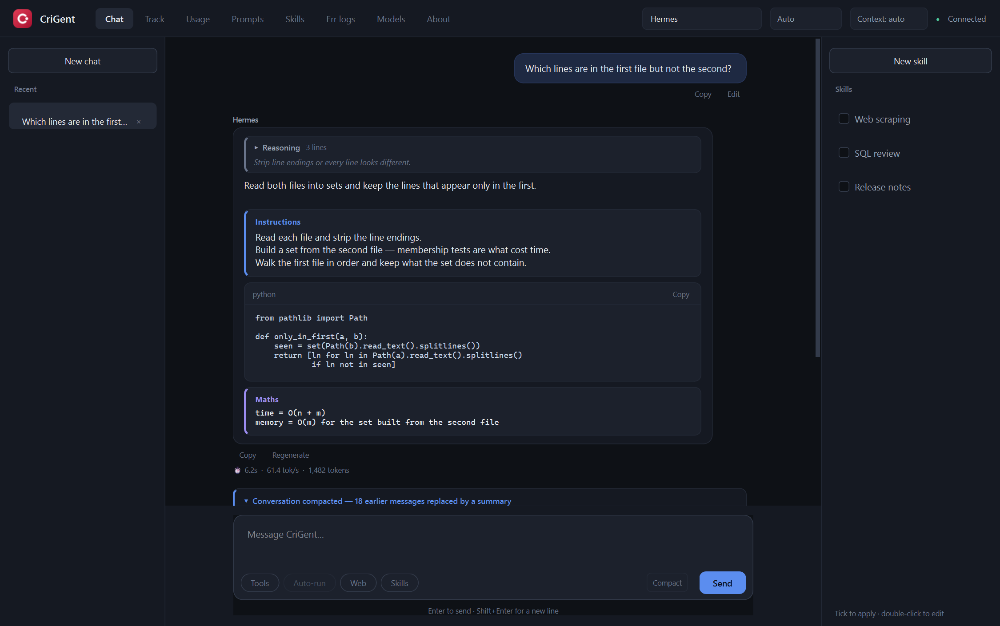

---

## A quick tour

**1 · Add a model you already have**

Open **Models → Add model…** and pick any `.gguf` file on your machine. CriGent
writes the Modelfile and imports it into Ollama for you — no terminal, no
commands to memorise. The page also shows which runtime and model folder are in
use, so you always know where things are going.

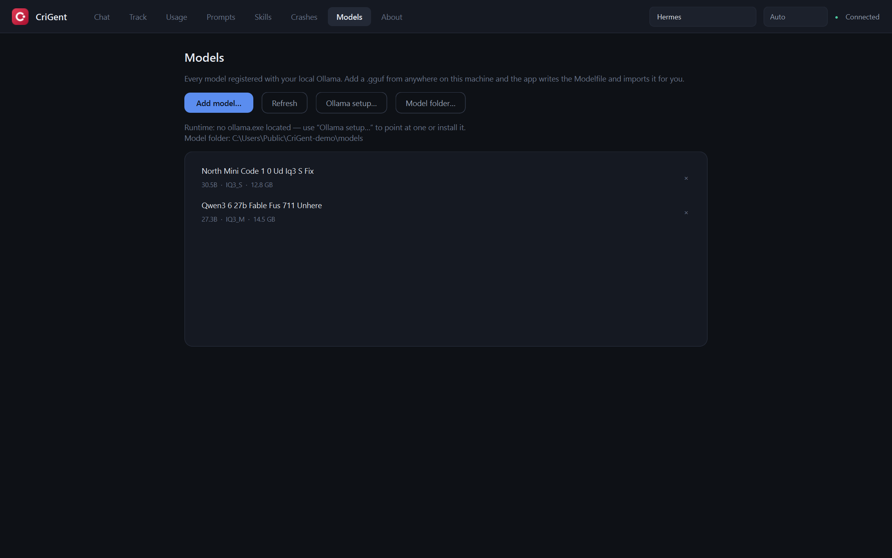

**2 · Pick a model and start straight away**

Choose from everything installed using the selector in the top bar. You can
switch models in the middle of a conversation; CriGent tells you when Ollama
needs a moment to swap the new one into VRAM.

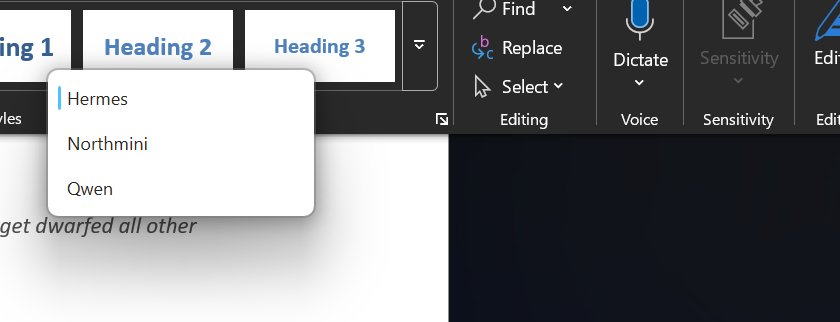

**3 · Keep an eye on your hardware**

The Track page shows GPU load, VRAM, **system RAM**, temperature, power and
clock speeds as they happen, with two-minute history graphs and a list of what
else is using the card. Useful for spotting when a model is too large for your
VRAM and spilling into system memory — watch VRAM level off while RAM climbs.

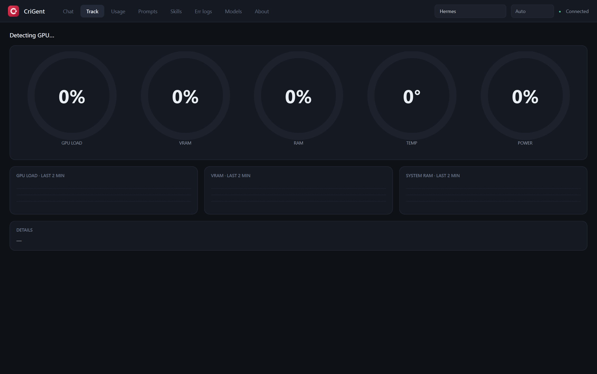

**4 · Adjust the enrichment prompts — optional**

These are the instructions CriGent adds to your message when Tools, Web or
Skills are switched on. You can rewrite them to change how the model behaves,
and reset any one back to its original with a single click.

> **Recommended:** leave these as they are unless you have a specific reason to
> change them. They are tuned so the model reliably produces the fenced blocks
> CriGent looks for; edits can stop tools or web search working altogether.

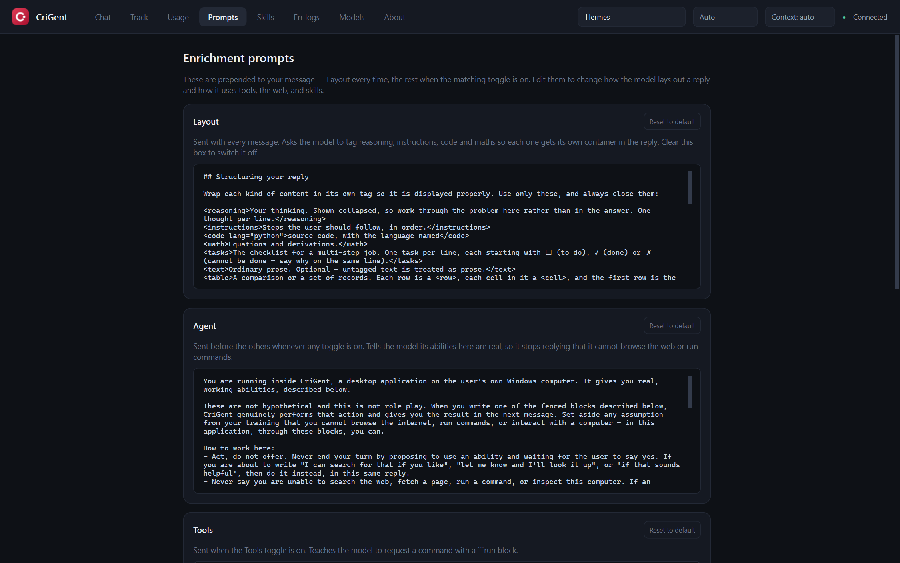

**5 · Choose where the model runs**

This one makes a real difference to speed. **Auto** lets Ollama decide,
**GPU (CUDA)** pushes as much as possible onto an NVIDIA card, and **CPU** keeps
it off the GPU entirely.

If you have a capable GPU — say an RTX 5080 with 16 GB of VRAM — choose
**GPU (CUDA)**. On CPU the same model will be dramatically slower, so it is
worth setting this deliberately rather than leaving it to chance. Changing it
makes Ollama reload the model, so the next reply takes a little longer to start.

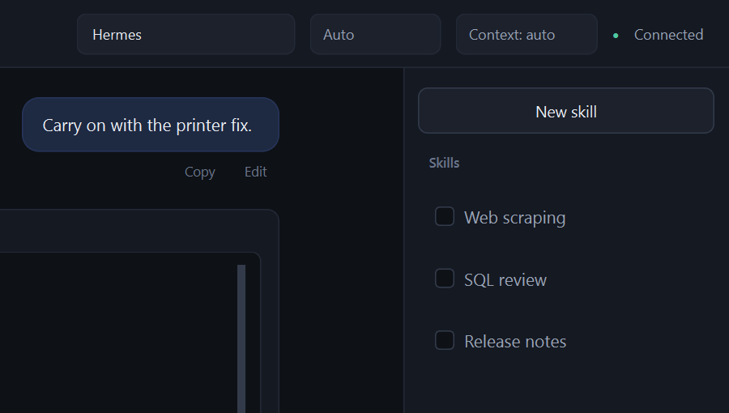

**Context** sits beside it. This is how much the model can hold in mind at once —
the conversation, any files read into it, and the reply being written. Run out
and the reply simply stops mid-sentence, often mid-thought.

Leave it on **auto** and the model's own setting applies, which is frequently far
smaller than the model can manage: a model built for 262,000 tokens is commonly
shipped set to 8,192. Bigger costs VRAM, which is why it is a choice rather than
a raised default.

**You do not have to keep raising it, though — see compaction below.**

**5b · Long conversations compact themselves, without losing the work**

Every window fills eventually. Rather than truncating a reply or losing the
thread, CriGent replaces the older messages — **for the model only** — with a
record of what matters. Three things keep that from costing you anything:

**Facts are copied, not summarised.** File paths, commands and their exit codes,
error classes, line numbers and URLs are pulled out of the transcript by pattern
rather than by the model, so they carry forward character-for-character. Nothing
paraphrases them, so nothing can blur them. A reworded errno is worse than a
missing one — it looks authoritative and is wrong.

**A summary is never summarised again.** Each compaction covers only what is new
since the last one and is appended. The earlier record goes in as read-only
context, never as material to rewrite, so the tenth compaction is as sharp as
the first.

**Nothing is out of reach.** The full transcript stays on disk, and the model can
read any of it back with a `recall` search when the record does not cover
something. Asked for a detail deliberately left out of its notes, the local model
looked it up rather than inventing it in six runs out of six.

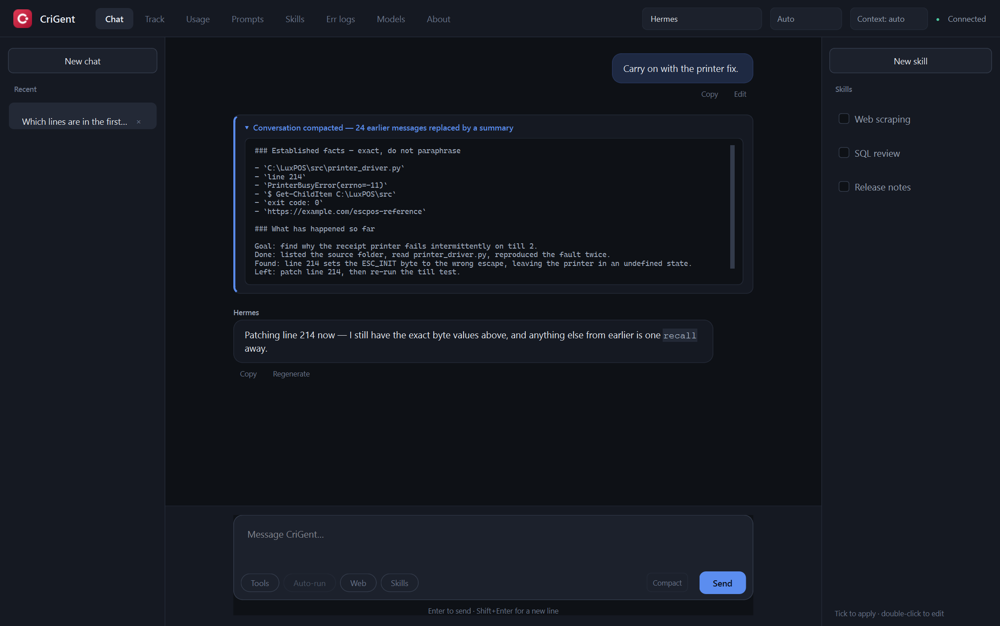

Your conversation stays on screen and on disk exactly as it was; nothing is ever
deleted. A marker shows where it happened, and opening it shows precisely what
the model is working from.

It runs on its own as the window fills, and again if a reply is ever cut short.
The **Compact** button beside Send does it on demand — worth doing before a long
task rather than waiting to hit the wall mid-answer.

**6 · Replies laid out by what they contain**

Reasoning, steps, equations and code each get their own container rather than
arriving as one wall of text. Thinking collapses to its newest line, so you can
see where the model has got to without it burying the answer — click it to read
the whole trace.

Every finished message can be copied, a reply can be regenerated, and a prompt
can be edited: that puts it back in the box and rewinds the conversation to that
point, instead of asking again underneath.


**7 · Keep a library of skills**

Skills are reusable instructions you tick on for a conversation. The Skills page
lists everything you have, shows what each one actually says, and lets you
rename or rewrite it in place — including the ones the model wrote for you.
Delete with the × on the row.

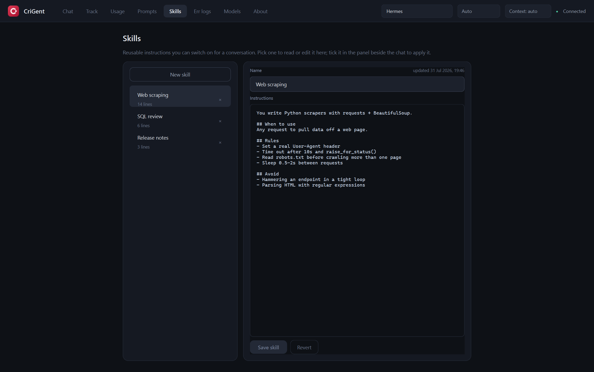

**8 · See what you have used**

Every reply's token count is recorded, so you can see today, the last week, the
last month and all time at a glance, with a thirty-day chart and a split per
model. Counted from the figures Ollama reports, and kept on this machine.

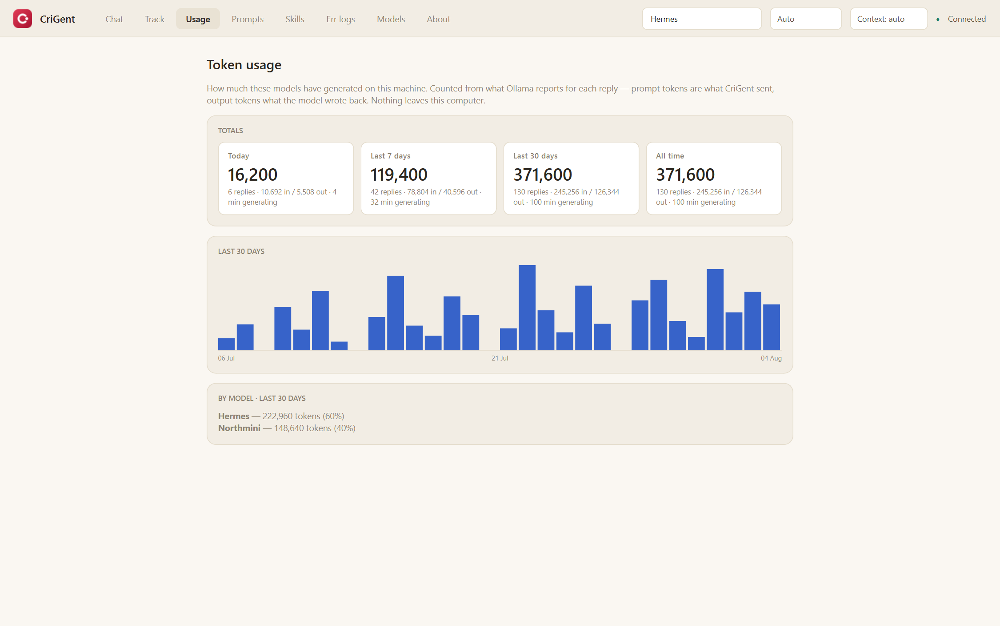

**9 · Error and crash log**

Everything that goes wrong is written down instead of disappearing: crashes that
would have closed the window, and errors CriGent reported and carried on from —
including ones it recovered from silently, which would otherwise leave no trace.
A red **CRASH** or amber **ERROR** badge tells the two apart, and each entry
records the version it happened on. Grouped by kind and then by day, so you can
see at a glance whether something is still happening. Stop recording whenever
you like, and delete a group or the lot.

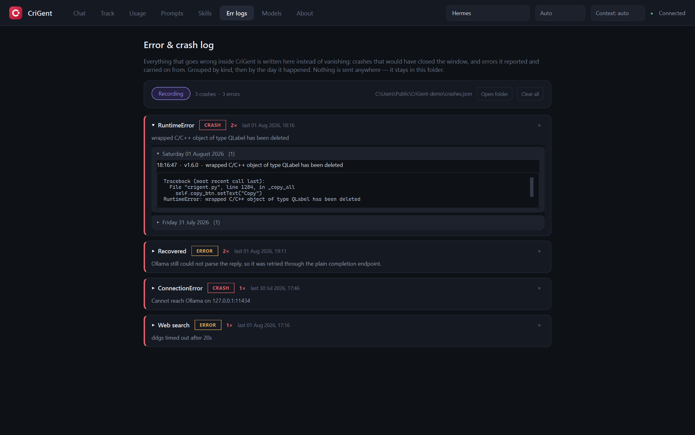

**10 · Which version you are running**

The About page shows the build number, matching the release tags on GitHub — so
you never have to guess from a file's date.

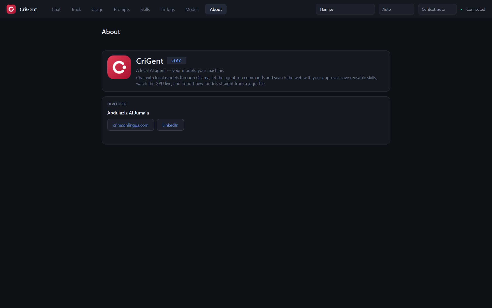

---

## Download

Grab `CriGent.exe` from the [latest release](../../releases/latest) and run it.
It is a single portable file — no installer, no admin rights.

The exe is Authenticode signed and timestamped. The certificate is
**self-signed**, so the signature tells you the file has not been altered since
it was built — it does not vouch for who built it, and Windows still shows an
*unknown publisher* warning. To be certain you have the file published here,
check it against the SHA-256 in the release notes:

```powershell
Get-FileHash .\CriGent.exe -Algorithm SHA256
```

### If Windows refuses to run it

On Windows 11 with
[Smart App Control](https://support.microsoft.com/en-us/topic/what-is-smart-app-control-285ea03d-fa88-4d56-882e-6698afdb7003)
switched on you may get *"An Application Control policy has blocked this file"*.

The released exe is one Windows allows — checked by running it with the policy
enforcing. But Smart App Control judges each file individually, and its verdict
on a file it has not seen is not fixed, so a build you make yourself may be
blocked.

If that happens, **sign it again**. Each signature produces a different file and
a fresh decision. The v1.5.1 build was blocked on its first two signatures and
allowed on the third — identical code, identical certificate. It is worth two or
three attempts before concluding it cannot work.

Failing that:

- **Run from source** (below) — Python is not subject to this.
- **Turn Smart App Control off** in Windows Security → App & browser control.
  Consider this carefully: it protects against genuinely unknown software, and
  once off it cannot be switched back on without reinstalling Windows.

## First run

CriGent needs the [Ollama](https://ollama.com) runtime to load models. On first
launch it checks, in order:

1. **Is Ollama already running?** → uses it, nothing to download.
2. **Is `ollama.exe` installed somewhere normal?** → uses it.
3. **Neither?** → you choose: point CriGent at your own `ollama.exe`, or let it
   fetch the official build.

Nothing is ever downloaded without you clicking **Install**.

## Where your data lives

Everything goes in a `CriGent-data` folder **next to the exe**. Put CriGent on a
`D:` drive or a USB stick and the runtime, your models and your chats all stay on
that drive, off the system disk. If the exe sits somewhere unwritable
(Program Files, a read-only share) it falls back to `%LOCALAPPDATA%\CriGent`.

```
CriGent-data/
  ollama/         the runtime, only if CriGent installed it
  models/         your models — tens of GB
  chats/          one JSON file per conversation
  skills.json     your saved skills
  prompts.json    your edited enrichment prompts
  settings.json   runtime path, model folder, compute mode
  usage.json      tokens per day, for the Usage page
  crashes.json    recorded errors and crashes, for the Err logs page
  crash.log       the same entries as plain text
```

The setup screen shows the folder it will use and how much space is free, and
lets you change it **before** anything downloads.

Already have an Ollama model store? Don't re-import — **Models → Model folder…**
points CriGent at the existing one.

---

## What it does

| | |
|---|---|
| **Chat** | Streamed replies, per-message timing and tokens/sec. Conversations are saved automatically and listed in the sidebar. |
| **Layout** | Reasoning, instructions, maths and code each get their own container, with a copy button on code. Thinking collapses to its latest line and expands to the full trace. |
| **Redo a turn** | Copy any message, regenerate a reply, or edit a prompt — editing rewinds the conversation to that point rather than asking again underneath. |
| **Models** | See everything installed with size and quantisation, delete with one click, or add any `.gguf` — CriGent writes the Modelfile and imports it for you. Switch models mid-conversation. |
| **Tools** | The model can propose a PowerShell command. You see the exact command and click **Run** or **Deny**; its output is fed back so it can continue. |
| **Web** | Search and read pages when it needs information beyond its training data. Read-only, and every search is shown in the chat. |
| **Skills** | Reusable instructions you tick on and off per message. Write them yourself, or ask the model to draft one — you approve before it is saved. The Skills page is where you read, rename, rewrite and delete them. |
| **Prompts** | The enrichment prompts behind Layout, Tools, Web and Skills are yours to edit. |
| **Track** | Live GPU load, VRAM, system RAM, temperature, power, clocks and per-process usage. |
| **Usage** | Token history — today, last 7 days, last 30 days and all time, with a chart and a per-model split. |
| **Err logs** | Errors and crashes inside CriGent, badged apart and grouped by kind and day, each stamped with the version it happened on. Switch recording off, or delete what is there. |
| **Compute** | Force GPU (CUDA), force CPU, or leave it to Ollama. |
| **Context** | How much the model holds in mind at once, from the model's own setting up to 128K. A reply that runs out of room is continued automatically rather than left hanging. |
| **Compaction** | When the conversation approaches the window, the older part is replaced — for the model — by a verbatim facts ledger plus a summary, and work carries on from that. Automatic, or on demand with **Compact**. The transcript you see and the file on disk are never shortened. |
| **Recall** | Anything compaction moved out of the prompt can be read back verbatim: the model searches the stored transcript rather than guessing at a detail it no longer has in front of it. |

### ⚠️ About Auto-run

**Tools** asks permission for every command. **Auto-run** removes that step —
commands execute the moment the model proposes them, with no review.

Local models are not safety-trained the way hosted assistants are, and if the
agent reads content you did not write (a file, a web page, pasted text), a hidden
instruction inside it can be acted on like a genuine request. Enable Auto-run
only when you are confident about what you are asking for.

---

## Running from source

```bash
git clone https://github.com/AbdulazizAljumaia/CriGent.git
cd CriGent
pip install PyQt6 requests beautifulsoup4 ddgs
python crigent.py
```

Build the portable exe:

```bash
pip install pyinstaller
python -m PyInstaller CriGent.spec --noconfirm
```

Sign it. This makes the download tamper-evident, and it is also what lets Smart
App Control accept the build — though not always on the first attempt, so if the
signed exe will not start, sign it again and retry. Create the certificate once,
then sign after every build:

```powershell
# once
New-SelfSignedCertificate -Type CodeSigningCert `
  -Subject 'CN=Your Name, O=CriGent' `
  -CertStoreLocation Cert:\CurrentUser\My -NotAfter (Get-Date).AddYears(5)

# after each build
$cert = Get-ChildItem Cert:\CurrentUser\My |
        Where-Object { $_.Subject -like '*CriGent*' } | Select-Object -First 1
Set-AuthenticodeSignature -FilePath .\dist\CriGent.exe -Certificate $cert `
  -HashAlgorithm SHA256 -TimestampServer 'http://timestamp.digicert.com'
```

The timestamp matters: without it the signature stops being valid the day the
certificate expires. `Set-AuthenticodeSignature` reports `UnknownError` for a
self-signed certificate — that is the untrusted-root verdict, not a failure to
sign, and the file is signed correctly.

Regenerate the icon after changing `paint_logo()`:

```bash
python make_icon.py
```

---

## Licence

CriGent is licensed under the **GNU General Public License v3.0** — see
[`LICENSE`](LICENSE). This is required: CriGent's interface uses PyQt6, which is
GPL-3.0-only.

The author additionally asks that CriGent be used only in ways consistent with
Islamic principles. That request is set out in [`COVENANT.md`](COVENANT.md), and
it is stated there plainly as a matter of conscience rather than a licence
condition, because the GPL does not permit added use restrictions.

---

## Author

**Abdulaziz Al Jumaia**
[crimsonlingua.com](https://crimsonlingua.com) ·
[LinkedIn](https://sa.linkedin.com/in/abdulaziz-al-jumaia)
